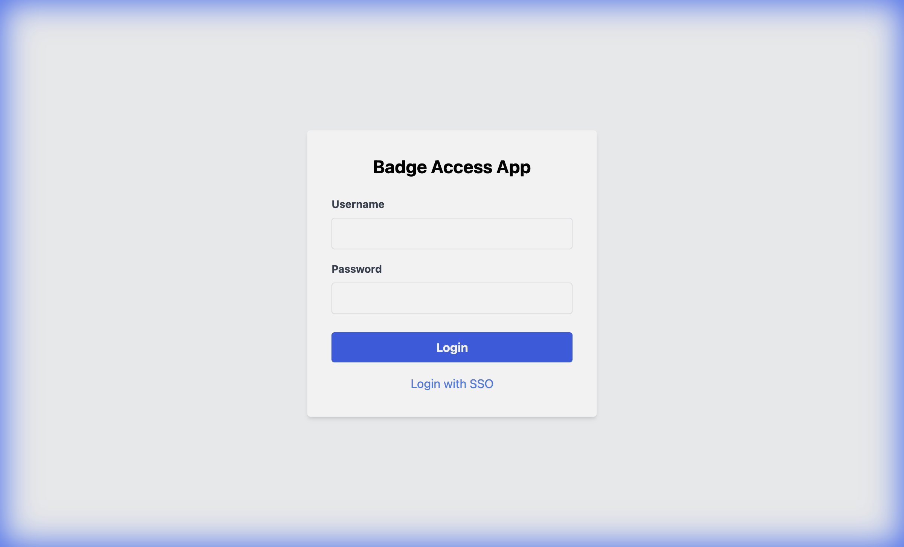
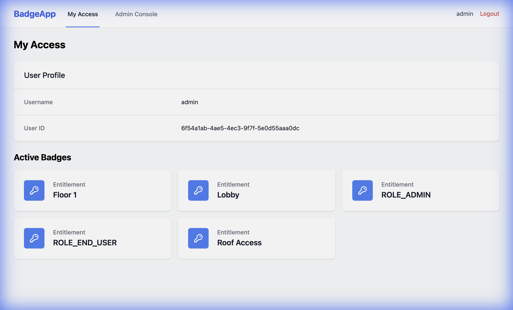
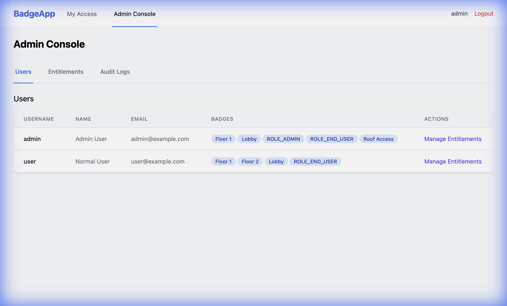
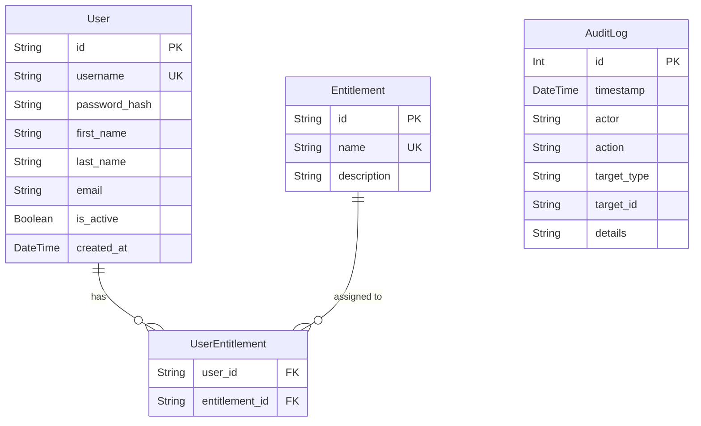

# Badge Access App (Monorepo)

A lightweight, single-tenant reference application designed to serve as a "Target System" for testing Identity and Access Management (IAM) integrations.

## Features
- **Monorepo:** Built with Turborepo.
- **Frontend:** React + Tailwind CSS (Vite).
- **Backend:** Node.js + Express + Prisma (SQLite).
- **Auth:** Local Login + OIDC Support.
- **Management:** User & Entitlement Management, Audit Logs.
- **Deployment:** Docker + Docker Compose.

## Screenshots

### Login Page


### Dashboard


### Admin Console


## Prerequisites
- Node.js 18+
- Docker & Docker Compose

## Getting Started

### Local Development

1.  **Install Dependencies:**
    ```bash
    npm install
    ```

2.  **Setup Database:**
    ```bash
    # Generate Prisma Client
    npx turbo run build --filter=api
    
    # Push Schema & Seed
    cd apps/api
    npx prisma db push
    npx ts-node prisma/seed.ts
    cd ../..
    ```

3.  **Run Development Server:**
    ```bash
    npm run dev
    ```
    - Web: http://localhost:3000
    - API: http://localhost:3001

### Docker Deployment

1.  **Build and Run:**
    ```bash
    docker-compose up --build
    ```
    - Web: http://localhost:3000
    - API: http://localhost:3001

## Default Credentials
- **Admin:** `admin` / `admin`
- **User:** `user` / `user`

## API Endpoints

### Auth
| Method | URL | Description |
| :--- | :--- | :--- |
| `POST` | `/auth/login` | Authenticate a user |
| `POST` | `/auth/logout` | Log out the current user |

### Users
| Method | URL | Description |
| :--- | :--- | :--- |
| `GET` | `/api/users` | List all users |
| `POST` | `/api/users` | Create a new user |
| `POST` | `/api/users/:username/entitlements` | Assign an entitlement to a user |
| `DELETE` | `/api/users/:username/entitlements/:entitlementId` | Remove an entitlement from a user |

### Entitlements
| Method | URL | Description |
| :--- | :--- | :--- |
| `GET` | `/api/entitlements` | List all entitlements |
| `POST` | `/api/entitlements` | Create a new entitlement |
| `DELETE` | `/api/entitlements/:id` | Delete an entitlement |

### Audit Logs
| Method | URL | Description |
| :--- | :--- | :--- |
| `GET` | `/api/audit-logs` | List recent audit logs (admin only) |

## Database Schema

### Entity Relationship Diagram


### Models

#### User
Represents a system user.
- `id`: Unique identifier (UUID)
- `username`: Unique login username
- `is_active`: Account status (default: true)

#### Entitlement
Represents an access right or permission.
- `id`: Unique identifier (UUID)
- `name`: Unique name of the entitlement

#### UserEntitlement
Join table linking Users and Entitlements (Many-to-Many).

#### AuditLog
Records system activities for security and compliance.
- `actor`: Who performed the action
- `action`: What action was performed
- `target_type`: The type of entity affected (e.g., "User")

